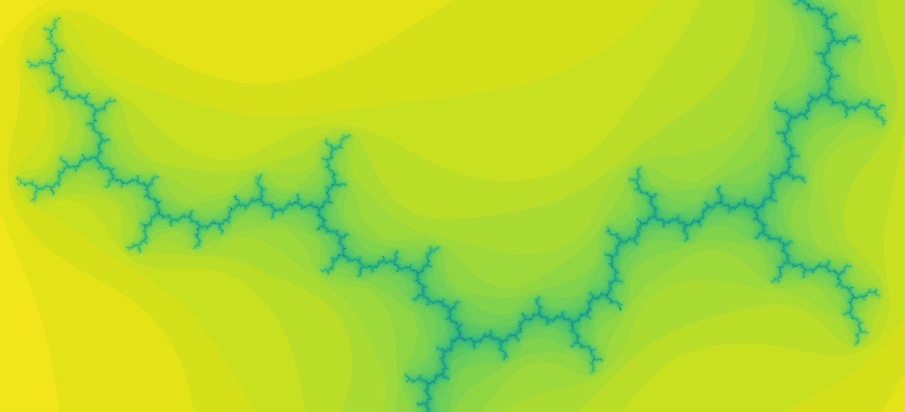

================
Task 2: Fractals
================

Fractals are really cool.
In this task you will make some visualisations of some well-known fractals such as the one above.

This is meant to be fun, and perhaps even pique your interest in the maths behind these amazing patterns, but the main aim here is to become familiar with the structure of a Python project, some common design patterns, and some key developer tools. There is no need to care about the maths unless you really want to!

The code for this task is based on `this repository <https://github.com/marshrossney/mandelbrot>`_.
Again, this will probably only be useful for the extension tasks.

.. rubric:: Contents

.. toctree:: 

    task_2/getting_started
    task_2/main_task
    task_2/extension
    task_2/finishing_up
    task_2/grading

.. rubric:: Aside on complex numbers

Don't be alarmed by the presence of ``complex`` in the code.
In Python, ``complex`` objects support most of the same operations as ``float`` objects, such as addition ``+`` and multiplication ``*``.
Given two ``float`` objects ``x`` and ``y``, a complex number ``z`` can be created ``z = complex(x, y)``.
If you're not familiar with complex numbers, just think of them as coordinates z = (x, y) in a two-dimensional plane.

